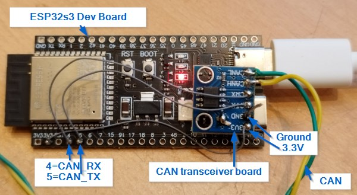

# wifican

Bridge between Wifi and CAN.

## Motivation

SavvyCAN is a great open-source CAN tool, and the ESP32RET is assumingly a pretty good interface between the PC and multiple CANs.
However, the try to use ESP32RET to create a simple single-channel-CAN interface using a good old ESP32 dev kit and adding a CAN transceiver,
was not successful.

The good old ESP32 board had the following issues:
- 1 MBit for the serial-USB did not work. It showed a lot of scrambled data, sometimes something senseful in between. Changing to 115k solved this, but is no real solution.
- Connecting to an existing Wifi network failed for unknown reason. The same hardware and same credentials work fine with a very old Arduino ESP32 installation, but not with the latest (Arduino 2.2.1, latest ESP32 arduino environment, 2023-10-03).
- Using a more up-to-date ESP32s3 board reveals incompatibilites:
    - The ESP32s3 does not support classic bluetooth, only BT low energy. This is not compatible with the ELM327 emulation, at least not out-of-the box.
    - The ESP32_CAN driver hangs endless loop in a high-prio CAN driver task, maybe due to changes in the scheduling concept of the espressif twai driver.

Out of this situation, the plan is create a minimal single channel device, which is a bridge between Wifi and CAN, and is still compatible to SavvyCAN.

## Solution

The better way would be to add fixes to the ESP32RET, but for experimentation the following approach was chosen:
- Instead of using the Libs which ESP32RET uses, copy the content directly into the project folder. This makes it easy to modify and develop, and to keep a consistent state.
- Single CAN channel: use the built-in TWAI of the ESP. No SPI, no MCP..., no FD support.
- One hard-coded configuration of the board. No EEPROM parameters.
- Kicked-out bluetooth completely.
- Kicked-out serial GVRET completely.

## Quick Start Guide

- Install the Arduino IDE and the ESP32s3 board support.
- Solder a 3.3V CAN transceiver board to the ESP32s3 board. This needs just four wires: 3.3V, ground, CAN_RX (pin 4), CAN_TX (pin 5).
- Connect the ESP32s3 board at the "COM" USB (not the "USB"-USB) to the PC.
- Rename the wifi_credentials_template.h to wifi_credentials.h, and enter your wifi credentials there.
- Build and download the project in the Arduino IDE.
- Open SavvyCAN, choose menu -> connection -> open connection window.
- Choose "Add new device connection", and "Network connection (GVRET)". In the IP address field there should automatically appear the IP of the wifican device. If not, check whether the wifican device and your PC are in the same Wifi network, or thy entering the IP manually.
- The wifican should now be visible in the connection list, with status "Connected".
- In the connection window, set the bus speed and check the "Enable bus" checkbox.
- Connect the CANH and CANL to your CAN network. The SavvyCAN should show the incoming traffic.
- SavvyCAN -> Menu -> SendFrames -> Custom allows you to transmit frames.

## Results of reverse-engineering

### How does a CAN transmission work?

- CANManager::sendFrame
- CAN_COMMON.sendFrame(...)
- ESP32CAN::sendFrame(CAN_FRAME& txFrame)
- twai_transmit()

The states and transitions of the ESP32S3 CAN driver are described here: https://docs.espressif.com/projects/esp-idf/en/latest/esp32s3/api-reference/peripherals/twai.html

### How does the CAN reception work?

- During startup, the task task_LowLevelRX is started.
- The task_LowLevelRX suspends in twai_receive().
- If data is available, the task_LowLevelRX resumes and calls processFrame().
- ESP32CAN::processFrame() filters and distributes the data, using xQueueSend(callbackQueue, ...)
- The task_CAN reads the messages from the queue: xQueueReceive(callbackQueue, ...) and calls the ESP32CAN::sendCallback.
- The ESP32CAN::sendCallback either calls
    - one of the listeners (gotFrame()) (but CANListener::gotFrame() is an empty function) or
    - a mailbox callback (cbCANFrame) or
    - a general callback (cbGeneral)
    
...
- CANManager::loop
    - canBuses[i]->available()
    - canBuses[i]->read(incoming)
    - CANManager::displayFrame --> wifiGVRET.sendFrameToBuffer(frame, whichBus)
    

### How is the receive callback path configured?
attachCANInterrupt() --> CAN_COMMON::setGeneralCallback() sets the cbGeneral.
canBuses[i]->watchFor() --> setRXFilter()
CAN_COMMON::attachCANInterrupt() --> CAN0.setCallback() --> 
...tbd...

### Is useBinarySerialComm true?

Yes, the SavvyCAN sends 0xE7 as first two bytes. This turns-on the binary mode.

